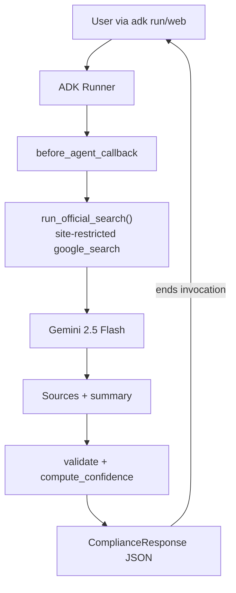

# Swedish Compliance AI Assistant

A production-oriented AI agent built with **Google ADK** that helps Swedish SME owners answer compliance questions grounded exclusively on official government websites.

## Overview

This assistant covers corporate law, taxation, VAT, company registration, labor regulations, and general compliance. It is designed for a technical interview challenge — the goal is to demonstrate **reliable agent engineering**, not legal expertise.

Every factual answer must be grounded using official sources:

- [skatteverket.se](https://www.skatteverket.se) — Swedish Tax Agency
- [bolagsverket.se](https://bolagsverket.se) — Companies Registration Office
- [verksamt.se](https://verksamt.se) — Business portal

## Architecture



### Module layout

| Module | Responsibility |
|--------|----------------|
| [`agent.py`](agent.py) | ADK `root_agent` definition and callback wiring |
| [`tools.py`](tools.py) | Domain constants and `google_search` query builder |
| [`prompts.py`](prompts.py) | Production system instruction |
| [`models.py`](models.py) | Pydantic schemas for structured output |
| [`utils.py`](utils.py) | Search, validation, confidence, logging, callback |

## Features

- **Google ADK native search** — uses Gemini `google_search` grounding (no custom RAG, embeddings, or vector DB)
- **Domain-restricted search** — every query uses `site:skatteverket.se OR site:bolagsverket.se OR site:verksamt.se`
- **Defense in depth** — prompt enforcement + Python allowlist validation on retrieved URLs
- **Deterministic confidence** — `high` / `medium` / `low` derived from official source count, never LLM-invented
- **Structured JSON responses** — `ComplianceResponse` via Pydantic
- **Coherent output** — a refusal answer always yields `low` confidence and empty sources (never a refusal wrapped in `high` confidence)
- **Graceful degradation** — safe fallback when no official sources are found
- **Structured logging** — query, search execution, source count, latency, confidence

## Design decisions

1. **Single LLM call per question** — the grounded search and the composed answer are produced by one site-restricted `google_search` call in `before_agent_callback`. Returning content there ends the ADK invocation, so the root agent's model never runs a second time. This halves token/quota usage and removes the duplicate prose+JSON output.

2. **Programmatic site-restricted search** — `run_official_search` issues an exact `(site:skatteverket.se OR ...)` query, because the model often mangles `site:` operators when left to search on its own.

3. **`site:` operator for domain filtering** — ADK's `GoogleSearchTool` does not expose `include_domains`; the official ADK pattern is site-specific queries in the search string, enforced programmatically.

4. **Citations from summary text, not redirect chunks** — on the Gemini API grounding chunks are opaque `vertexaisearch` redirect links, so the search assistant is instructed to list full official `https://` URLs in its answer, which are then filtered to official domains only.

5. **Confidence from specific pages** — computed in Python:
   - `high` — 2+ distinct official *deep pages*
   - `medium` — 1 official deep page
   - `low` — only homepages or nothing → safe fallback message

   Bare homepages (e.g. `https://www.skatteverket.se/`) never inflate confidence, since they are not citations for a specific claim.

6. **No `output_schema` with `google_search`** — the two cannot be combined on the Gemini API, so the final `ComplianceResponse` JSON is assembled in Python after validation.

## Troubleshooting

### 401 UNAUTHENTICATED / ACCESS_TOKEN_TYPE_UNSUPPORTED

1. **Check for a duplicated key in `.env`** — if the key was pasted twice, authentication fails. Keep a single value only.
2. **Use a valid Gemini API key** from [Google AI Studio](https://aistudio.google.com/apikey). New keys may start with `AQ.` instead of `AIza`.
3. Ensure `GOOGLE_GENAI_USE_ENTERPRISE=0` when using the Gemini API (not Vertex AI).

### 400 — google_search and Function Calling cannot be combined

This project intentionally avoids `output_schema` on the agent when `google_search` is enabled. Final JSON is assembled in Python inside `before_agent_callback` instead.

### 429 RESOURCE_EXHAUSTED / quota exceeded

The Gemini API free tier caps `gemini-2.5-flash` at 20 requests/day. Each question uses a single call. Wait for the daily reset or enable billing for a higher quota.

## Limitations

- Domain restriction depends on the model following search instructions; Python validation is the safety net.
- `google_search` does not guarantee access to every government page.
- This is **not legal or tax advice** — an informational assistant only.
- Swedish language content on official sites may require users to read source pages directly.

## Installation

```bash
python -m venv .venv

# Windows
.venv\Scripts\activate

# macOS / Linux
source .venv/bin/activate

pip install -r requirements.txt
```

## Configuration

Copy the example environment file and add your API key:

```bash
cp .env.example .env
```

Required variables (Gemini API):

```env
GOOGLE_GENAI_USE_ENTERPRISE=0
GOOGLE_API_KEY=your-api-key-here
```

Get a key from [Google AI Studio](https://aistudio.google.com/apikey).

## How to run

From the **parent directory** of this project (or use `.` when inside the agent folder):

```bash
# Interactive CLI
adk run Interview_prep

# Or from inside the project folder
adk run .

# Web UI (ADK built-in, not a custom frontend)
adk web .
```

## Example questions

- How do I register an aktiebolag in Sweden?
- How do I calculate karensavdrag?
- What VAT rate applies to restaurant services?
- What are the employer obligations for hiring the first employee?
- How do I apply for F-skatt?

## Example response shape

```json
{
  "summary": "Brief overview of the answer.",
  "answer": "Detailed explanation grounded on official sources.",
  "official_sources": [
    {
      "title": "Page title from Skatteverket",
      "url": "https://www.skatteverket.se/..."
    }
  ],
  "confidence": "high",
  "limitations": "Any caveats or missing information."
}
```

When no official sources are found:

```json
{
  "summary": "I could not find sufficient information from the official Swedish authorities to answer this confidently.",
  "answer": "I could not find sufficient information from the official Swedish authorities to answer this confidently.",
  "official_sources": [],
  "confidence": "low",
  "limitations": "No official sources from skatteverket.se, bolagsverket.se, or verksamt.se were found."
}
```

## Future improvements

- Optional VAT calculator tool (deterministic, no LLM)
- Vertex AI deployment for native structured output + enterprise web grounding
- Evaluation suite with golden Q&A pairs from official sources
- Swedish/English language toggle in responses
